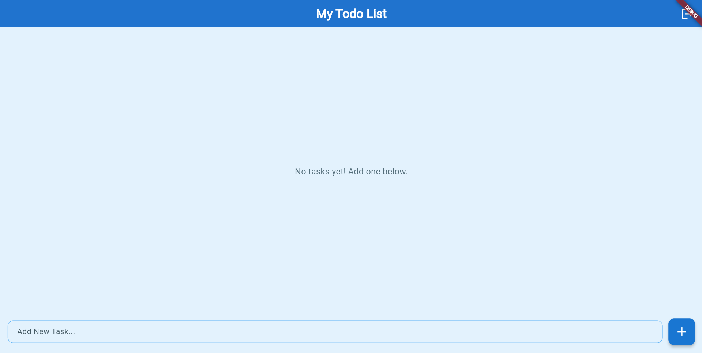
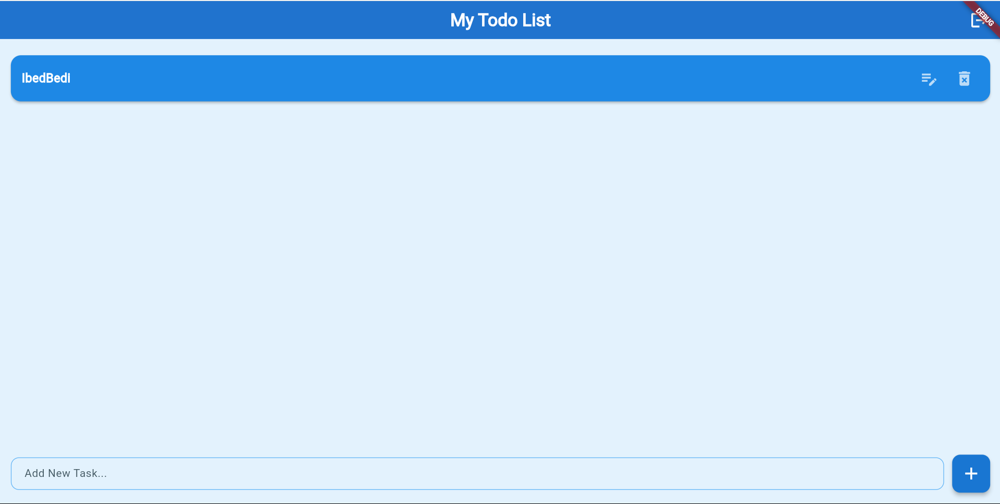
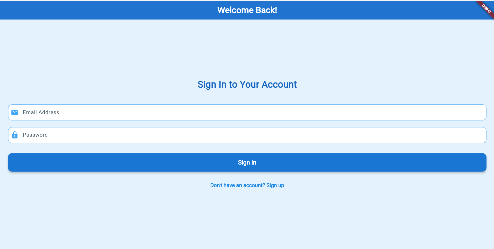

# ToDoUASMDI

### 👤 Nama Kontributor:
- Muhammad Labib ([@labib748](https://github.com/labib748))

### 📌 Judul Proyek:
**ToDoList Mobile App – Flutter Based**

---

## 📱 Deskripsi Aplikasi

ToDoList adalah aplikasi mobile yang dikembangkan menggunakan **Flutter** untuk membantu pengguna mengelola daftar tugas mereka secara efisien. Aplikasi ini memungkinkan pengguna untuk:

- Menambahkan tugas baru
- Menandai tugas yang telah selesai
- Menghapus tugas
- Melihat daftar tugas secara real-time

Aplikasi ini bersifat ringan, cepat, dan memiliki antarmuka pengguna yang bersih dan intuitif.

---

## ✨ Tampilan Antarmuka (UI Preview)

Berikut adalah beberapa tampilan dari aplikasi ToDo Fizard:

### 🖼️ Halaman Utama


### ➕ Tambah Tugas


### ✅ Login 


---

## 🔧 Teknologi yang Digunakan

| Teknologi         | Keterangan                              |
|-------------------|------------------------------------------|
| **Flutter**       | Framework UI utama                      |
| **Dart**          | Bahasa pemrograman utama                |
| **Firebase** *(opsional)* | Backend (untuk autentikasi atau database realtime) |
| **Material Design**| Untuk tampilan dan elemen UI           |

---

## ▶️ Cara Menjalankan Aplikasi (Local Development)

### 1. **Clone Repository**
```bash
git clone https://github.com/labib748/UAS_MDI.git
cd UAS_MDI
